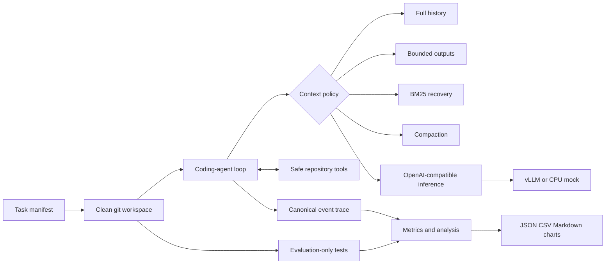

# ContextLab — Context Management for Coding Agents

ContextLab is an open-source experimental framework for asking a deceptively
simple question: **when coding agents use shorter prompts, does total inference
work actually fall?** A policy may save prompt tokens yet trigger more model
requests, retrieval, repeated repository exploration, compaction calls, or
wall-clock delay. ContextLab measures the whole run rather than one request.

The project provides a real iterative coding agent, safe repository tools,
OpenAI-compatible vLLM inference, four interchangeable context policies,
isolated official evaluation, controlled experiment scheduling, structured
traces, and report generation. CPU-only tests and demonstrations use a clearly
labelled deterministic mock; they are not presented as model performance.

## Architecture



Canonical execution history is immutable and independent of what a policy
presents to the model. Every policy preserves system constraints, original task
instructions, current objective, and the tool protocol. Switching policy does
not change the agent loop.

## The four policies

- **Full history** is the untruncated baseline. An oversized prompt becomes an
  explicit context-window failure.
- **Bounded tool output** applies per-tool and global budgets with head/tail,
  search-result, and error-focused reductions. Complete output remains in the
  canonical trace; this policy does not secretly retrieve it.
- **Retrieval** keeps a recent active window and uses separate BM25 indexes for
  repository chunks and historical observations. Results carry paths, line
  ranges, content hashes, scores, latency, and token volume.
- **Compaction** replaces older presented history with a structured summary.
  Deterministic mode supports tests; model mode uses the configured inference
  backend. Compaction input, output, request count, and latency are included in
  total workload.

See [policy design](docs/policies.md) and [repository retrieval](docs/retrieval.md).

## Install

Requirements: Python 3.11+, Git, and (for real inference) Linux with a
vLLM-supported NVIDIA GPU.

```bash
python -m venv .venv
source .venv/bin/activate
python -m pip install -e ".[dev,analysis]"
contextlab doctor
```

No unit test downloads model weights. Configuration is strict Pydantic YAML;
unknown fields fail early. Copy `.env.example` when using Docker and never
commit credentials or model caches.

## CPU-only demonstration

```bash
contextlab tasks list
contextlab agent run \
  --task benchmarks/tasks/localized_bug.yaml \
  --policy full-history \
  --config configs/agent.yaml \
  --mock \
  --output results

contextlab benchmark run --config configs/benchmark.yaml
contextlab benchmark report --results results/context-policy-demo
```

The benchmark config compares all four policies at short, medium, and long
budgets from clean copies of one baseline. The mock emits iterative tool
decisions that inspect, edit, and test the fixture; hidden evaluation tests then
determine official success.

## Real inference with vLLM

Qwen2.5-Coder-7B-Instruct is the documented default because it supports long
code context and an instruction/chat template. Hardware capacity varies; lower
`VLLM_MAX_MODEL_LEN` if KV-cache memory is insufficient.

```bash
docker compose --profile gpu up vllm
contextlab doctor --endpoint http://127.0.0.1:8000/v1

contextlab agent run \
  --task benchmarks/tasks/localized_bug.yaml \
  --policy retrieval \
  --config configs/agent.yaml \
  --endpoint http://127.0.0.1:8000/v1 \
  --seed 17
```

ContextLab requests a validated JSON action protocol instead of relying on
provider-specific native tool calls. Malformed outputs get bounded correction
opportunities through normal agent steps. See [vLLM setup](docs/vllm.md).

## Benchmarks and evaluation

The bundled suite covers a localized bug, multi-file bug, feature, refactor,
and exploration task. Each manifest declares its baseline, task text, limits,
visible validation, hidden evaluation path, and success criteria. Agent tools
are rooted in an isolated clone and cannot resolve evaluation-only paths.
Official correctness comes only from evaluation tests run after the agent exits.

SWE-bench Verified is intentionally described as optional and is not claimed as
supported by this repository: official dataset access, container images, and
the official evaluator must be installed and verified separately. Internal and
external results must never be combined without an explicit source label.

See [task creation and evaluation](docs/benchmarks.md).

## Metrics and reports

Each event includes experiment, run, task, policy, and step identifiers.
ContextLab records official success and pass rate; explicit overflow, execution,
and timeout failures; prompt/generated/auxiliary tokens; request count and
latency; first-token timing when streamed; tool time; repeated reads/searches;
retrieval volume and latency; output reductions; compaction workload; and
context growth by step. Client token estimates and server usage remain separate.

Reports contain raw JSONL traces, immutable run JSON, aggregate JSON and CSV,
Markdown, and seven charts. Statistics include sample sizes, success/failure
counts, medians, and percentile distributions. Reports never invent missing
measurements or infer that context loss caused a repeated call without trace
evidence.

```bash
contextlab trace summarize --input results/context-policy-demo/traces/RUN.jsonl
```

See [controls and metrics](docs/experiments.md) and
[reproduction](docs/reproduction.md).

## Safety and isolation

Repository paths are resolved beneath a per-run workspace. Commands are argv
arrays executed without a shell, checked against an allowlist, given timeouts,
and supplied a restricted environment. Reads are size bounded. Every run clones
the same committed baseline, and no solution, state, index, or modified file is
reused across comparisons.

This is defense in depth for controlled research fixtures, not a general
hostile-code sandbox. Use containers or stronger isolation for untrusted tasks.

## Development

```bash
ruff format --check .
ruff check .
mypy contextlab
pytest --cov=contextlab
docker compose --profile dev run --rm dev
```

CPU CI runs on Python 3.11 and 3.12. GPU/vLLM validation is a separate manual
self-hosted workflow; its presence is not evidence that it has run.

## Documentation

- [Coding-agent architecture](docs/agent.md)
- [Context policy design](docs/policies.md)
- [Retrieval and recovery](docs/retrieval.md)
- [Benchmark tasks and evaluation](docs/benchmarks.md)
- [Experimental controls and metrics](docs/experiments.md)
- [vLLM and GPU setup](docs/vllm.md)
- [Reproducing results](docs/reproduction.md)
- [Threats to validity](docs/threats-to-validity.md)

## Known limitations

Model nondeterminism, retrieval quality, lossy compaction, benchmark
contamination, serving caches, tokenizer mismatch, and hardware variability can
all alter results. The fallback byte estimator is not a substitute for the
selected model tokenizer in publication-grade runs. The safe command runner is
not a kernel sandbox. Bundled tasks are deliberately small and cannot establish
general coding-agent superiority. See [threats to validity](docs/threats-to-validity.md).

## License

MIT
